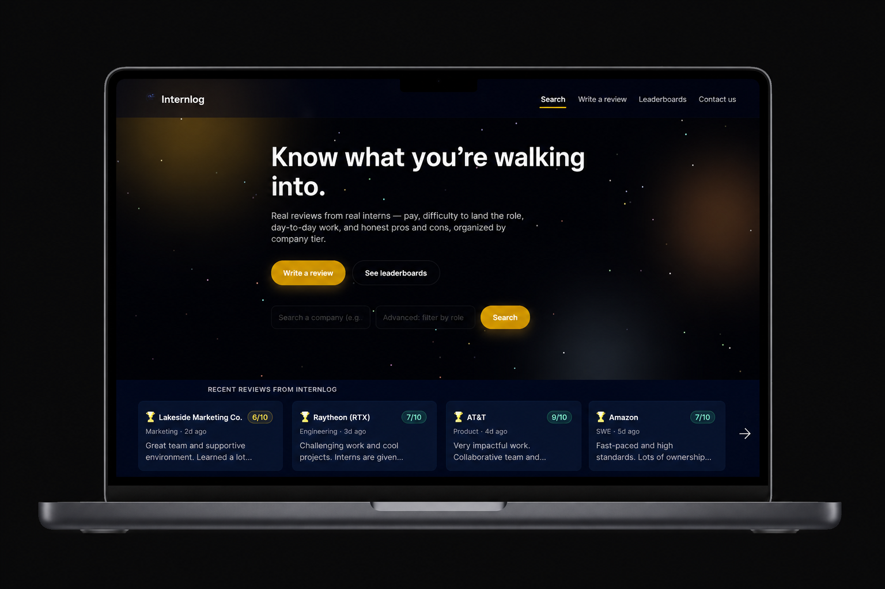

# 🚀 Internlog

<p align="center">
  
</p>

<h3 align="center">
Honest, anonymous internship reviews by students, for students.
</h3>

<p align="center">
A community-driven internship transparency platform helping students make smarter career decisions through real internship experiences.
</p>

<p align="center">
  
</p>

<p align="center">
  
</p>


<p align="center">


</p>

<p align="center">
  <a href="https://your-live-url.com">
    
  </a>
  <a href="https://github.com/nicklukekurian-web/Internlog">
    
  </a>
</p>

**🌐 Live Demo:** https://internlog-onrender-com.onrender.com/


# 📌 About Internlog

Finding internship information should not feel like going in blind.

Students applying for internships often rely on scattered Reddit posts, outdated forums, or general workplace review websites that do not focus specifically on internship experiences.

Internlog was created to solve this problem.

Internlog allows students to anonymously share internship experiences including:

- What they worked on
- Interview difficulty
- Internship rating
- Compensation information
- Company culture
- Daily responsibilities
- Application insights


The goal is simple:

> Build the most transparent and student-focused internship information platform.

---

# 💡 Why We Built Internlog

While preparing for internships, we noticed that students often had unanswered questions:

- What is the internship actually like?
- What does a normal day look like?
- Is the interview process difficult?
- Is the company a good place for interns?
- Is the internship worth applying for?

Existing platforms rarely answer these questions.

Internlog bridges this gap by creating a centralized database of student experiences.

This project also demonstrates real-world software engineering practices including:

- Full-stack application development
- Backend API design
- Security implementation
- User privacy considerations
- Moderation workflows
- Database planning
- CI/CD automation


---

# ✨ Features

## 🏢 Anonymous Internship Reviews

Students can submit:

- Internship rating (1-10)
- Company name
- Internship role
- Internship tier
- Interview difficulty
- Pros and cons
- Day-in-the-life experience
- Internship dates
- Location
- Optional hourly compensation


---

## 🔍 Advanced Search

Users can discover internships by:

- Company
- Position
- Rating
- Location
- Internship tier


Designed to help students quickly find relevant experiences.

---

# 🏆 Internship Tier System

Internships are categorized by company scale:


| Tier | Description |
|---|---|
| 🟢 Tier 1 | Local companies and startups |
| 🔵 Tier 2 | Regional and nationally recognized companies |
| 🟣 Tier 3 | Large national and international companies |


---

# 📊 Internship Insights

Internlog provides community-driven analytics:

- Average internship ratings
- Interview difficulty trends
- Salary transparency
- Popular internship roles
- Company rankings


---

# 🛡 Security & Privacy

Security was a major focus during development.

Implemented security practices include:

✅ HTTPS support  
✅ Input validation  
✅ Rate limiting  
✅ Environment variable protection  
✅ Secure backend architecture  
✅ OWASP vulnerability awareness  
✅ Responsible vulnerability disclosure  
✅ Moderation workflow  


Internlog intentionally avoids requiring user accounts to protect student privacy.

---

# 🚩 Moderation System

Internship reviews are designed to remain honest while preventing abuse.

Every submission requires users to confirm:

- The review represents their own experience
- Information is accurate to the best of their knowledge
- No confidential company information is shared
- No personal information about others is included


Users can report inappropriate reviews through the community reporting system.

---

# 📧 Automated Moderation Workflow

Internlog includes automated moderation support:

- Review submission notifications
- Report alerts
- Email-based moderation workflow
- Admin review process


---

# 🧠 Content Quality & Fraud Detection

Internlog includes a rule-based scoring system that flags likely low-quality or fake reviews for moderator attention before they're published.

Every submission is scored across multiple engineered signals:

- **Lexical analysis** — review length and vocabulary diversity (type-token ratio), to catch low-effort or filler submissions
- **Near-duplicate detection** — word n-gram shingling with Jaccard similarity, comparing each new review against existing reviews for the same company to catch copy-pasted or lightly-edited duplicates
- **Rating-extremity detection** — flags extreme ratings (1 or 10) paired with thin review text, a common pattern in fake or retaliatory reviews
- **Generic/templated language detection** — pattern matching against common low-effort phrasing ("very good," "n/a," etc.), weighted by how much of the review they make up
- **Promotional link detection** — flags spam links and commonly-abused domains in review text

Each review gets a 0–100 quality score, a risk level (low/medium/high), and a list of the specific reasons behind the score — all of which are appended directly to the existing email-based moderation workflow so a human moderator sees exactly why a review was flagged, with full context, before deciding anything.

**Design principles:**
- **Never auto-rejects.** The system flags and explains; a human always makes the final call. This keeps a legitimate but unusually-phrased review from being silently blocked.
- **Transparent by design.** Every score is explainable — no black-box model, no opaque probability. Every flag traces back to a specific, human-readable reason.
- **Built for the data that exists.** Rather than training a model on a handful of reviews (a dataset far too small for a real classifier to generalize from), this stage uses interpretable heuristics and doubles as instrumentation — moderator accept/reject decisions on flagged reviews are captured as labeled data for a future trained classifier once real usage generates enough volume.
- **Zero marginal infrastructure cost.** Runs in-process inside the existing Express API — no separate service, no new dependencies, no additional hosting cost.

This was built as a deliberate first step toward applied ML/fraud-detection work: starting from a transparent, production-safe heuristic system, instrumenting the pipeline to collect real labeled outcomes, with a trained classifier as the natural next stage once there's enough real-world data to train one responsibly.

---

# 🏗️ Technical Architecture

Current architecture:


```
Frontend
│
├── HTML5
├── CSS3
└── JavaScript


Backend
│
├── Node.js
├── Express.js
└── REST APIs


Data Layer
│
└── PostgreSQL (Supabase)

Security
│
├── Rate Limiting
├── Input Validation
└── Environment Variables
```


---

# 🛠 Tech Stack

## Frontend

- HTML5
- CSS3
- JavaScript ES6


## Backend

- Node.js
- Express.js


## Tools

- Git
- GitHub
- GitHub Actions
- Nodemailer


## Database

- PostgreSQL (Supabase)


---

# 📚 What We Learned

Building Internlog provided hands-on experience with:


### Software Engineering

- Full-stack web development
- REST API development
- Backend architecture
- Application structure


### Security Engineering

- Input validation
- Rate limiting
- Secure environment configuration
- OWASP security practices


### Professional Development

- Git workflows
- CI/CD pipelines
- Documentation
- Open-source development


---

# 👨‍💻 Contributors


## Nicholas Kurian

GitHub:
[@nicholaskurian](https://github.com/nicklukekurian-web)


Focus:

- Full-stack development
- Backend architecture
- Security implementation
- Project design


---

## Suhaas Voruganti

GitHub:
[@suhaas-voruganti](https://github.com/suhaas-voruganti)


Focus:

- Full-stack development
- Feature implementation
- Testing
- Project collaboration


---

## Version 1 ✅

Completed:

- Anonymous internship reviews
- Company search
- Internship tiers
- Review reporting
- Email moderation
- Responsive design
- GitHub Actions
- Security documentation

---

# 📜 Legal & Documentation

Internlog includes:

- Privacy Policy
- Terms of Service
- Security Policy


---

# 📄 License

This project is licensed under the MIT License.


---

# ⭐ Support

If you find Internlog interesting, consider starring the repository.

Built with ❤️ by students, for students.

Helping students make better internship decisions through transparency.
